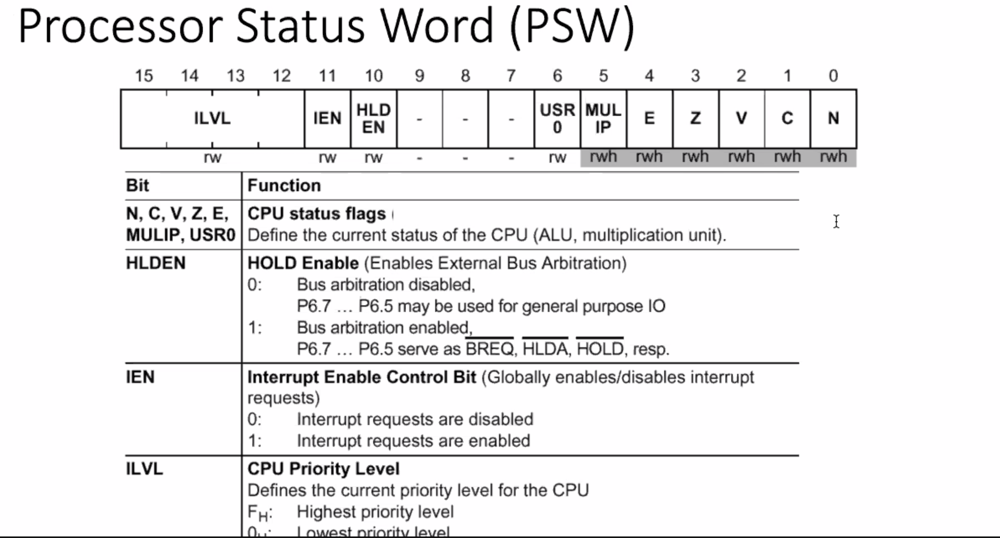
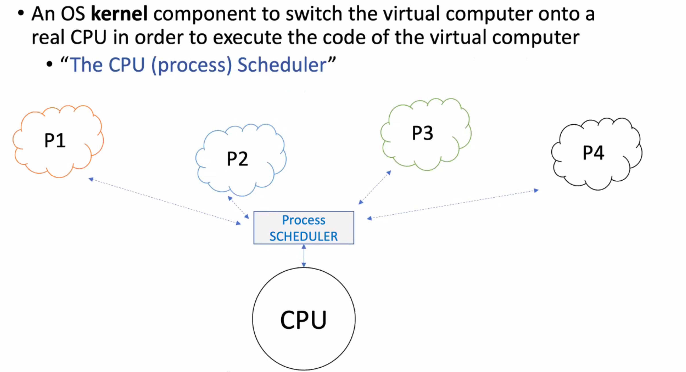
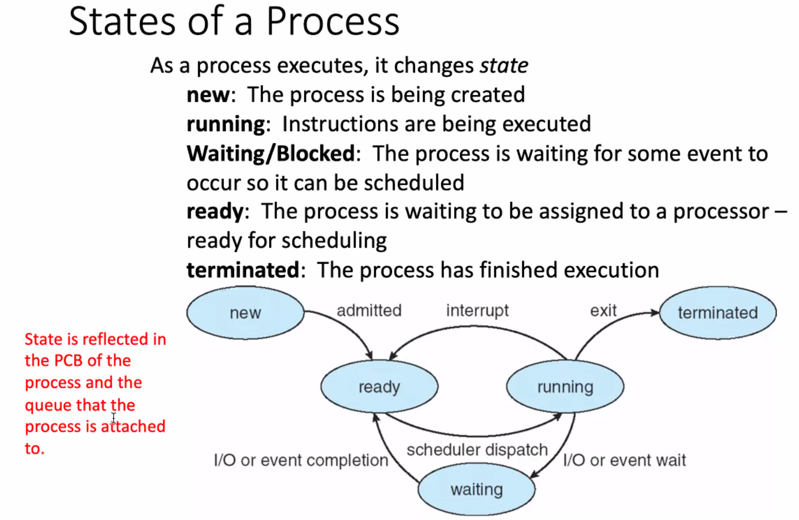

# Week 2 - Virtualizing the CPU
---
Process Abstraction
---
  - When you run a .exe file, the OS creates a process
  - multiple programs are running at a time
  - OS is timesharing CPU
    - How?
    - Policy: which process to run
    - Mechanizm: how to "context switch" between processes

What constitutes a process?
---
- A unique identifier (PID)
- Memory image
  - Code and data (static)
  - stack and heap (dynamic)
- CPU context: registers
- File descriptors
  - pointers to open files/ devices

How does OS create process?
---
- Allocates memory and creates memory image
  - load code and data from disk
  - create runtime stack and heap
- Open basic files
  - STDIN, OUT, ERR
- Initialize CPU registers

CPU state of a process
---

#### Process Sceduling: A computer has one or more CPUs, which execute the instructions of programs. Modern OSs are preemptive mulitasking systems.
- Multitasking means that multiple processes can simultaneously reside in memory and each uses the CPU(s)
- Preemptive means that the rules governing whoch processes recieve use of the CPU and for how long are determined by the kernal process scheduler(rather than processes themselves)

---

