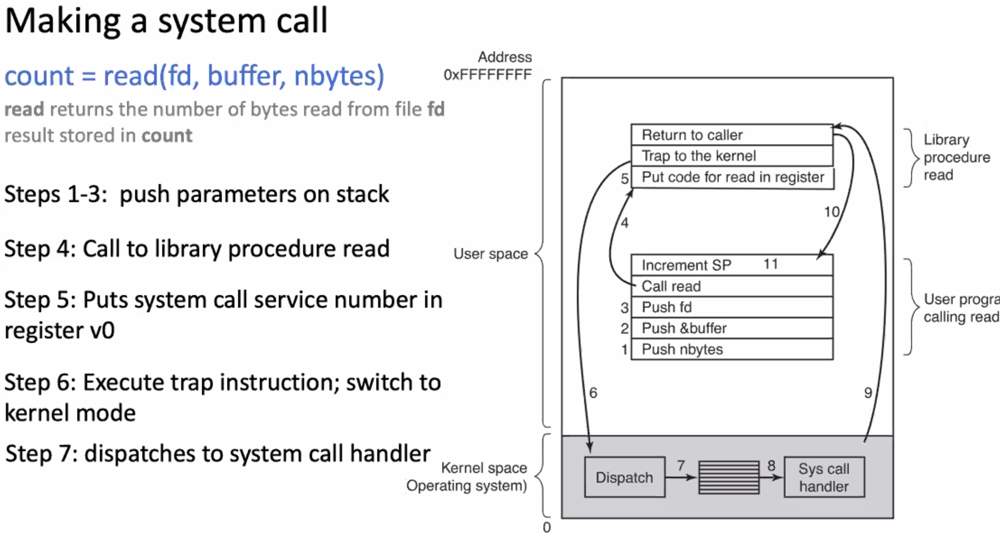

# Week 3 part 1 - Virtualizing the CPU cont. Time Sharing
---

Problem 1: protecting access to restricted resources
---
Solution: Protected Control Transfer
---
- Operating system carefully exposes protected functionality using **privilege modes**
  - stored in CPU mode bit/Priviledge level status register
  - user mode:
    - "privildged" instructions and registeres disabled by CPU
    - value of mode bit = 0
  - kernal mode
    - all insrtuctions enable
    - value of mode bit = 1

System calls
---
- implemented as a *trap instruction* that transfers control to the OS
  - execution of a sytem call changes mode from user to kernal

- planned *program-to-kernal* transfer of control
- mechanisms to realize system call: *trap* instruction
  - jump into kernal
  - raise priviledge to kernal mode
  - allow for manipulation of critical resources: peripherals, memory etc
  - *return-from-trap* instruction 
    - return into calling user program
    - reduce priviedge back to user mode

- trap instruction differs from procedure call instruction:
  - procedure call does not change the CPU priviledge mode
  - trap cant indicate an arbitrary address or relative address where the system call is located since it is executed in the kernal
    - instead uses 8-bit field in the instruction to indicate service requested
    - this service number gives index mapped into *trap table*
      - stores pointers to system call handlers indexed by service number

SYSCALL instruction: Safe transfer of control to OS
---

System Call Libraries and Wrappers
---
- Compilers do not emit `SYSCALL` instructions
  - compilers do not know OS interface
  - could different accross architectures
- Libraries implement a standard api wrapper for OS API

Where does the OS live?
---
- in its own address space?
  - but then `syscall` would have to switch to a different address space
  - also harder to deal with `syscall` arguments passed as pointers
- So, lives in the same address space as process
-   use protected bits to prevent user code from writing over kernal 